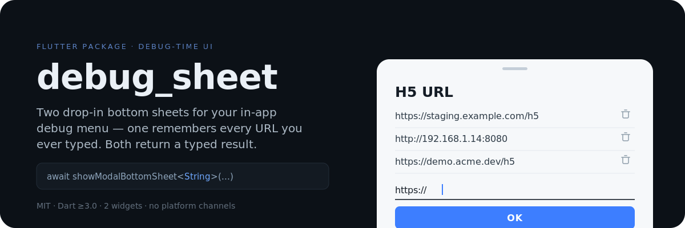
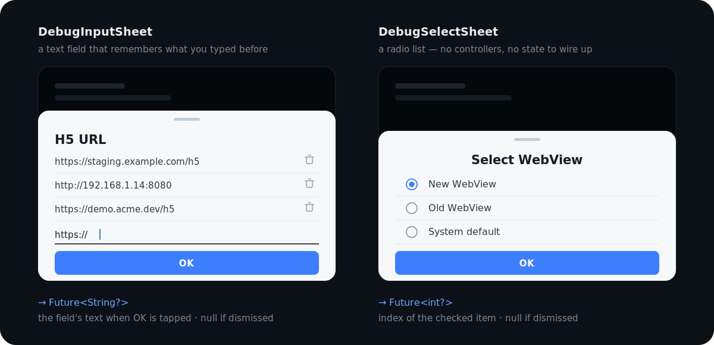

<p align="center">
  
</p>

<p align="center">
  <a href="./LICENSE"></a>
  
  
</p>

Every app ends up with a hidden dev drawer: paste a staging URL, switch WebView engines,
flip a feature flag. Building that means a `TextField`, a controller, somewhere to remember
what you typed last time, and a screen to put it all on.

`debug_sheet` is those two screens, already built. Call `showModalBottomSheet`, `await` the
result, move on.

## The two sheets



Neither takes a controller, a callback, or a builder. Both hand you a value back through
`Navigator.pop`, so they slot into any `showModalBottomSheet` call you already have.

## Quick start

```yaml
dependencies:
  debug_sheet:
    git:
      url: https://github.com/sunbird89629/debug_sheet.git
```

History is stored with [`get_storage`](https://pub.dev/packages/get_storage), so initialize it once:

```dart
void main() async {
  WidgetsFlutterBinding.ensureInitialized();
  await GetStorage.init();
  runApp(const MyApp());
}
```

Then ask for a URL:

```dart
final url = await showModalBottomSheet<String>(
  context: context,
  isScrollControlled: true, // lets the sheet resize around the keyboard
  builder: (_) => const DebugInputSheet(title: 'H5 URL'),
);
if (url != null) loadWebView(url);
```

Type it once. Every time after that it's sitting in the list, one tap away.

## `DebugInputSheet`

A text field with a persistent history list above it.

```dart
const DebugInputSheet({required String title})  // → Future<String?>
```

`title` is both the heading and the storage key. The sheet returns the field's contents when
**OK** is tapped, or `null` if the field was empty or the sheet was dismissed.

How the list behaves:

- Every non-empty value you confirm goes to the top of the history for that `title`, so the
  list reads most-recent-first. Confirming a value that's already there moves it back up
  rather than duplicating it.
- **Tapping** a row copies it into the text field — it does not close the sheet. Edit it or tap
  **OK** to confirm.
- The **trash icon** on the right removes that row permanently.
- The storage key is `md5(title)`, so two sheets sharing a title share one history — and
  renaming a sheet starts an empty one.

## `DebugSelectSheet`

A single-select radio list.

```dart
const DebugSelectSheet({required String title, required List<String> items})  // → Future<int?>
```

Pick which WebView the debug build should use:

```dart
final index = await showModalBottomSheet<int>(
  context: context,
  builder: (_) => const DebugSelectSheet(
    title: 'Select WebView',
    items: ['New WebView', 'Old WebView'],
  ),
);
```

`items` becomes the rows, in order; the sheet returns the index of the checked one, or `null`
if dismissed.

The first row starts checked, so tapping **OK** without touching anything returns `0`, not
`null`. There is no parameter for the initial selection yet.

## Good to know

- **Debug-time UI.** These sheets use plain Material defaults and no theming hooks — they're
  meant for a drawer your users never open, not for production surfaces.
- **History is uncapped.** Duplicates are folded into one entry, but the list grows until you
  delete rows by hand.
- **Not on pub.dev.** Depend on it via git, as shown above.

## Example

A runnable demo lives in [`example/`](./example) — one page, two buttons, showing the result
each sheet returns.

```bash
cd example
flutter run
```

## Development

```bash
flutter test    # 10 widget tests covering both sheets
```

## License

MIT — see [LICENSE](./LICENSE).
